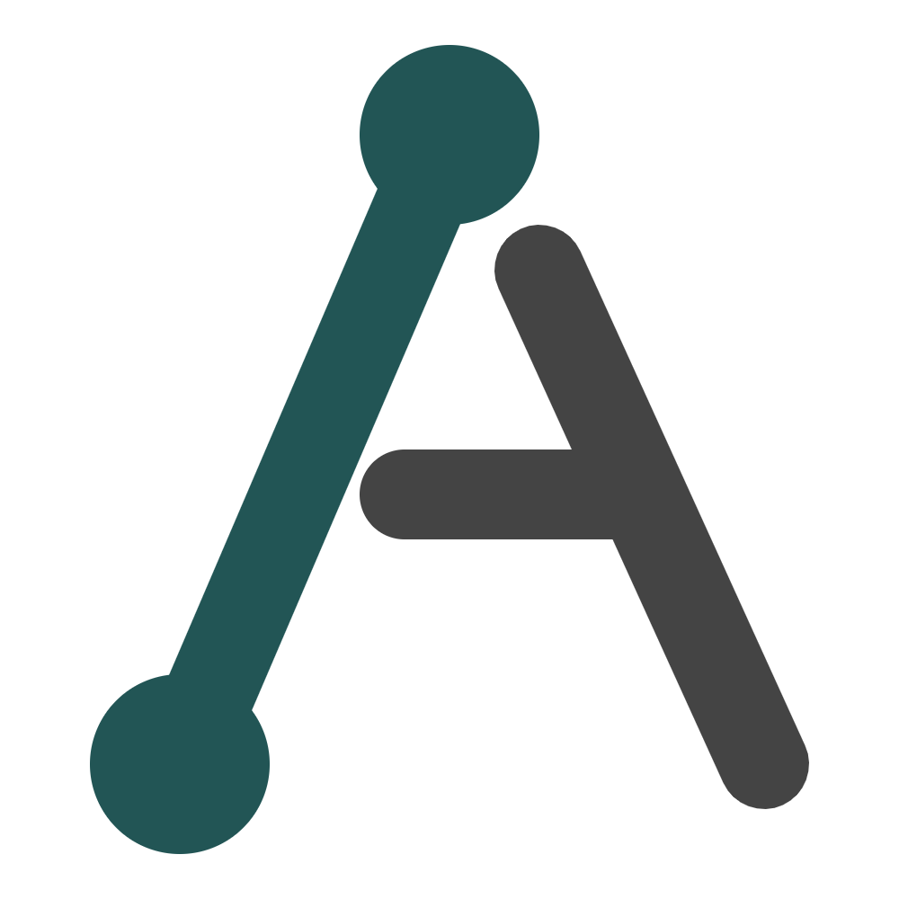

# Alat - That's One Device That's All Your Devices

> [!NOTE]
> This is generated by `qwen` cli free and I didn't review it, or
> I would say I didn't take my time to correct some exagerations.
> But the basic idea is there.



> **Slogan**: *"That's one device that's all your devices."*

## The Vision

Alat is not just another device management tool—it's a fundamental rethinking of how devices should interact in our digital ecosystem. Where traditional approaches treat devices as separate entities that need to be "connected," Alat envisions a world where devices are truly unified into a single computational fabric.

This project represents a complete reimagination of the original Alat project, moving away from complex multi-component architectures toward a simpler, more robust design that prioritizes system integration over standalone applications.

## From the Old to the New

The original Alat project (https://github.com/ken-morel/alat-old) was an ambitious effort to create a cross-platform toolkit for device service sharing. While it laid important groundwork, it suffered from:

- **Architectural fragmentation**: Separate core, library, desktop app, and mobile app components
- **Complexity overhead**: Multiple codebases maintaining the same functionality
- **Interface friction**: Adding yet another application to users' workflows rather than integrating with existing ones
- **Shared state challenges**: Difficulties in maintaining consistent state across distributed components

This new Alat addresses these issues through a radical simplification and refocusing:

| Aspect | Original Alat | New Alat |
|--------|---------------|----------|
| **Language** | Go | Rust (memory safety, performance) |
| **Architecture** | Multi-component (core, lib, apps) | Unified three-layer (nlem, platform, app) |
| **State Management** | Shared mutable state | Channel-based communication |
| **Interface Philosophy** | Standalone applications | System integration + minimal UI |
| **Discovery Protocol** | mDNS | UDP broadcast (more reliable, simpler) |
| **Extensibility** | Complex integration points | Simple trait-based services |

## Core Architecture

### The Heart: `nlem` (NLEM = "Heart")
The core logic layer, named `nlem` (not "core" to follow Rust crate naming conventions), serves as the central nervous system of the Alat ecosystem. It implements:

- **Node**: The central coordinator that unites all components
- **Services**: Modular units that provide specific functionality (pairing, telemetry, etc.)
- **Controllers**: Components that consume services to perform actions (clipboard sync, file transfer, etc.)
- **Device Manager**: Handles discovery, pairing, and connection management
- **Storage**: Persistent data management
- **Platform Abstraction**: OS-specific functionality

### Communication Model
Instead of shared mutable state, Alat uses a channel-based communication model:
- Each component communicates with its parent via dedicated channels
- The Node processes events, performs actions, and relays messages
- Application state is maintained by the UI layer, which receives `NodeEvent` notifications

This creates a more robust, predictable architecture where components are loosely coupled but tightly coordinated.

### Service-Controller Pattern
Alat organizes functionality around two key abstractions:

1. **Services**: Units that may provide:
   - A worker thread/task
   - A gRPC server
   - A client implementation
   - To implement a service, simply implement the `Service` trait

2. **Controllers**: Components that consume services to perform actual operations:
   - Clipboard synchronization
   - File transfer
   - Notification forwarding
   - Media control

This separation allows for clean extension—new services can be added without modifying existing code, and controllers can be composed from multiple services.

## Technical Implementation

### Discovery Protocol
Alat uses UDP broadcast on port 4147 for device discovery:
- Devices advertise their presence every 5 seconds
- The application scans for broadcasts and maintains discovered devices
- Devices are considered lost after 15 seconds of no advertisement
- More reliable and simpler than mDNS while maintaining cross-platform compatibility

### Security Model
- Each device has a unique ID and certificate
- Pairing involves secure certificate exchange with user confirmation
- User approval via desktop notifications (Linux) ensures security without compromising usability

### Data Storage
- Configuration and paired device data stored in JSON format
- Location: `~/.config/cm.engon.alat/data.json`
- Structured for easy migration and backup

## Why This Approach Works Better

1. **System Integration First**: Rather than adding another application to your workflow, Alat integrates with your operating system, making device interaction feel native.

2. **Simplified Extensibility**: The service-controller pattern makes it trivial to add new functionality without disrupting existing code.

3. **Robust Communication**: Channel-based messaging eliminates race conditions and makes the system more predictable.

4. **Focused Scope**: By concentrating on core device pairing and management, Alat delivers a more reliable experience than the overly ambitious original.

5. **Cross-Platform Foundation**: The clean separation between platform-specific code and core logic makes future platform support (macOS, Windows) straightforward.

## Getting Started

### Prerequisites
- Rust toolchain (latest stable)
- Cargo package manager
- For UI development: Slint build tools

### Installation
```bash
git clone https://github.com/engon/alat.git
cd alat
cargo install bacon  # Optional: enhanced development experience
```

### Building and Running
```bash
# Using Bacon (recommended)
bacon run          # Run the application
bacon check        # Check for compilation errors
bacon clippy       # Run Clippy linter
bacon test         # Run tests

# Using Cargo directly
cargo build --package app
cargo run --package app
```

## Usage Philosophy

Alat is designed to be used as part of your normal workflow, not as a separate application you launch. The minimal Slint UI provides just enough interface for initial setup and monitoring, while the real power comes from system integration:

1. Devices automatically discover each other on your local network
2. Pairing requires explicit user confirmation for security
3. Once paired, devices become available as extensions of your primary device
4. Services and controllers operate in the background, enhancing your workflow seamlessly

## Future Roadmap

- **Controllers**: Implement clipboard synchronization, file transfer, notification forwarding
- **Services**: Add media control, remote input, screen casting
- **Platform Support**: Extend to macOS and Windows
- **Mobile Integration**: Create lightweight mobile clients that integrate with the desktop node
- **Advanced Discovery**: Add Bluetooth and Wi-Fi Direct discovery options

## Contributing

Contributions are welcome! Please follow these guidelines:
- Submit pull requests against the main branch
- Ensure all code follows Rust formatting standards (`cargo fmt`)
- Include appropriate tests for new functionality
- Update documentation for significant changes

All contributions become part of the original work under the same license terms.

## License

This software is licensed under a custom license that permits educational use, personal modification, and contributions, but explicitly prohibits commercial use without explicit written permission.

For commercial licensing inquiries, contact: [engonken8@gmail.com](mailto:engonken8@gmail.com) or [me@engon.cm](mailto:me@engon.cm)

See [LICENSE](LICENSE) for full details.

## Support

For questions or issues, please open an issue in the repository or contact the maintainer at [engonken8@gmail.com](mailto:engonken8@gmail.com) or [me@engon.cm](mailto:me@engon.cm).

## Website

- **Alat Project**: [https://alat.engon.cm](https://alat.engon.cm)
- **Developer Portfolio**: [https://engon.cm](https://engon.cm)

---

*Alat is developed by Engon Ken Morel. The name "Alat" means "tool" in several languages, reflecting the application's purpose as a tool for device unification.*
