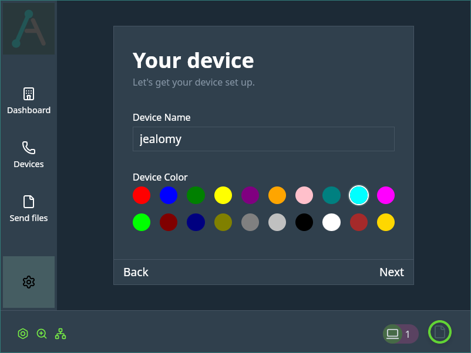

# Alat: Your Devices, Unified.

  

Alat is a set of tools made to work for several platforms which provides
devices to share services together.

## Components

Alat constutes of a few parts including:

### Alat core

Core of the project, alat core provides most of alat services in a cross-platform
manner(best as possible). Alat core is written in :go: and contains logic and
procedures for:
- basic security using certificates and id's
- discovery using mdns, can be deactivated for platforms like `android` where
  that is not possible.
- alat common services, have their implementation, configuration, grpc servers
  and client there organised in a modularized manner.

The features of alat core are exposed through a `libalat` aimed at providing an easy way to integrate alat into other applications and is used for mobile application. It exposes a C-compatible API and language-specific bindings that make it easy to embed Alat functionality into desktop, mobile, and embedded applications. For mobile platforms we provide "dalat", an FFI wrapper used to integrate libalat into Android  builds when platform-specific code is required..

### Applications

A desktop application tested on windows and linux.
A mobile application is also on it's way but slowed down due to android limitations forcing me to crafttailored, platform-specific alternatives, the mobile application relies on `dalat`, providing ffi bindings for `libalat`.

## Services

What's makes alat alat, is the fact it provides several services on most if not all of it's supported platforms.

Roadmap:

- [x] File sharing
  * [x] alat -> alat file sharing
    * [ ] file verification with checksums
    * [ ] partitioning files to gradually reconstitute and check
  * [x] web sharing via local server and browser
- [x] Device information
- Sync
  - [ ] Clipboard synchronization
  - [ ] Notification synchronization
  - [ ] Share text/url. Don't sync clipboard, just send text in dedicated window.
- Control
  - [ ] Media control
  - [ ] Run commands
- File system tools
  * [ ] Folder synchonization
  * [ ] File system exploration
- Input tools
  * [ ] Presentation control
  * [ ] Remote keyboard input
  * [ ] Remote mouse input
- extras:
  * [ ] Screen casting(good enough for presentations)
