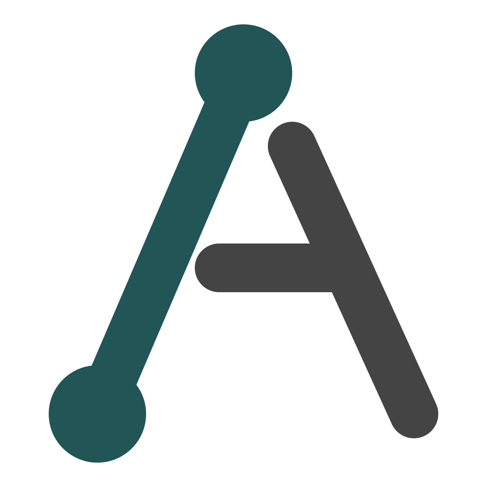

<h1 style="text-align: center; font-size: xxx-large;">
  
  lat
</h1>

Alat is a set of services and applications aimed at prociding a seamless interface common to all devices to connect them together. It's work is greatly inspired from [kde konnect], (though i don't think thet have any relationship).

For it to work, alat exposes features to paired decices through `services`, which you can configure and control.

Alat has like not even started it's development, and very breaking changes are expected.

## Contributing

Alat is simply a go workspace with a core package, and a wails desktop application built go, sveltekit, typescript and sass.
A more detailed explanation of how the project works internally can be found in [./GEMINI.md] .

## Building

The app should be pretty easy to build, make sure you have go programming language installed, use it then to install wails cli(check <https://wails.io>), then just build as a normal wails application or using the manage.fish's. Norice the dev commands are targeted for my device running ubuntu 25.04 on amd64.

Thanks!
