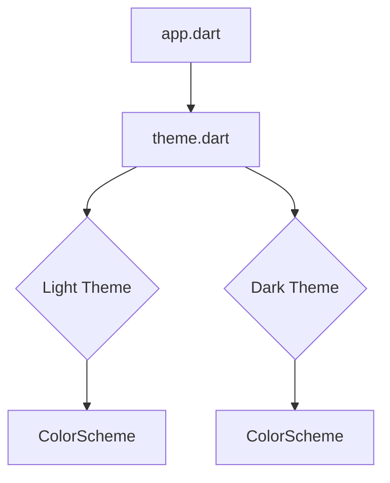

# Mobile App Theme Modification Design

## Overview

This document outlines the design for implementing a new theme system in the Alat mobile application. The goal is to create a visually appealing and consistent theme that supports both light and dark modes, based on the design language of the desktop application.

## Analysis of the Goal or Problem

The current mobile application lacks a cohesive and well-defined theme. This leads to an inconsistent user interface and a poor user experience. Implementing a proper theme system will address the following issues:

*   **Inconsistent UI:** Without a centralized theme, UI elements are styled inconsistently across the app.
*   **Lack of Branding:** A well-defined theme will help to establish a clear brand identity for the application.
*   **Poor User Experience:** A consistent and visually appealing theme will improve the overall user experience.
*   **No Dark Mode:** The current implementation does not support dark mode, which is a standard feature in modern mobile applications.

## Alternatives Considered

*   **Third-party theme packages:** Using a third-party package could speed up development, but it would also introduce an external dependency and might not offer the level of customization required to match the desktop application's theme.
*   **Manual styling:** Continuing with manual styling for each widget is not a scalable or maintainable solution.

## Detailed Design

The proposed solution is to create a new `theme.dart` file that will contain the theme definitions for the application. This file will be located in the `lib/` directory, next to `app.dart`.

### Color Palette

The color palette will be based on the colors defined in the `theme.css` file of the desktop application. The following colors have been converted from OKLCH to HEX:

*   **Primary:** `#005595`
*   **Secondary:** `#00754a`
*   **Tertiary:** `#8c0068`
*   **Light Background:** `#eeeeee`
*   **Dark Background:** `#3a4455`
*   **Light Text:** `#3a4455`
*   **Dark Text:** `#e4e6ea`

### Theme Definition

The `theme.dart` file will contain two `ThemeData` objects: one for the light theme and one for the dark theme. These themes will be generated using the `ColorScheme.fromSeed()` method, with the primary color as the seed.

The themes will be configured with the following properties:

*   **Rounded Corners:** All widgets will have rounded corners, as specified in the `[data-theme="alat-rounded"]` section of the CSS file. This will be achieved by setting the `borderRadius` property of the relevant shape themes (e.g., `cardTheme`, `elevatedButtonTheme`).
*   **Spacing:** The theme will enforce consistent spacing and padding throughout the application.
*   **Material 3:** The theme will be based on the Material 3 design system.

### Integration

The new themes will be integrated into the application in the `app.dart` file. The `MaterialApp` widget will be configured with the `theme`, `darkTheme`, and `themeMode: ThemeMode.system` properties.

### Diagram

## Summary of the Design

The proposed design will introduce a new theme system to the Alat mobile application, providing a consistent and visually appealing user interface that supports both light and dark modes. The theme will be based on the desktop application's design language, ensuring brand consistency across all platforms.

## References

*   [Material Design 3](https://m3.material.io/)
*   [Flutter Theming Guide](https://flutter.dev/docs/cookbook/design/themes)
*   [OKLCH Color Picker & Converter](https://oklch.com/)
